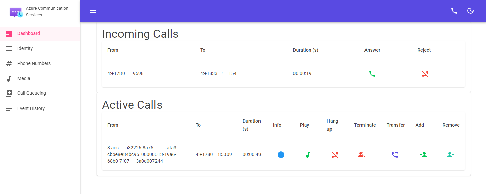

# Azure Communication Services Dashboard

This project uses the following Azure Communication Services (ACS) SDK's to create a simple dashboard for managing Call Automation scenarios, reading purchased phone numbers, and handling ACS identities.



## Prerequisites

- Provision an Communication Service resource in Azure.
- Obtain your **connection string** from the Azure portal for use below.
- Provision at least one phone number to test inbound and outbound PSTN calling.
- Obtain the latest version of NGROK
- Install the latest version of .NET 6.

## NGROK Configuration

NGROK is used to receive the web hook callbacks, and for this project, it's used to receive the IncomingCall event sent by Event Grid.

- Run: `ngrok http https://localhost:7154`.
- Save your **NGROK public FQDN** for use below
- Log into the Azure portal, locate your Communication Service resource, and click the Events section.
- Create an Event Grid subscription for `Microsoft.Communication.IncomingCall` making sure to point it at your NGROK public FQDN.

## Application Configuration

- Clone the project.
- Open the solution with Visual Studio 2022
- Right-click on the CallingDashboard project and choose **Manage User Secrets**
- Configure your `secrets.json` file as follows:

```json
{
    "ACS": {
        "ConnectionString": "[your_connection_string]",
        "CallbackUri": "[your_ngrok_public_fqdn]"
    }
}
```
